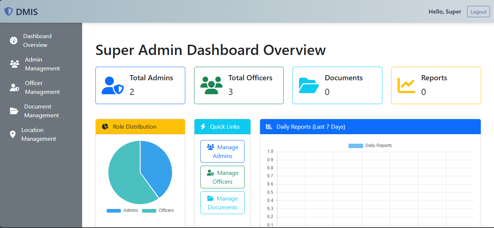
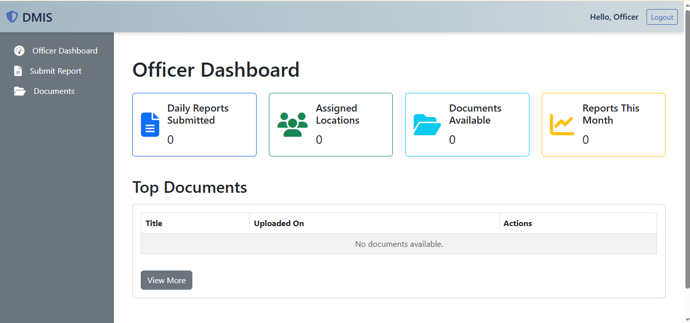
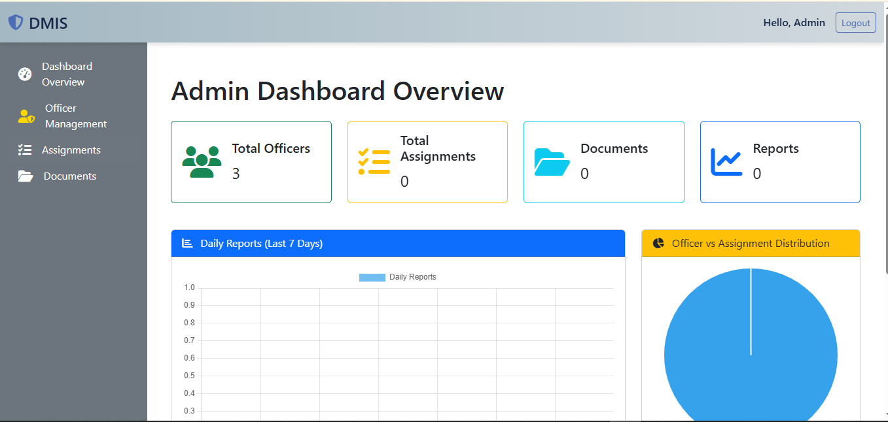
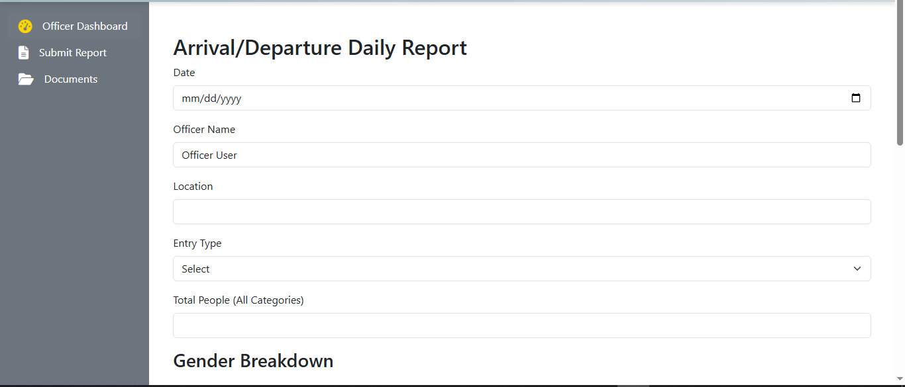
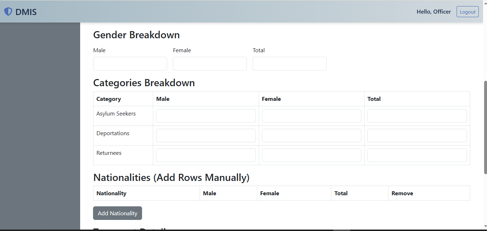
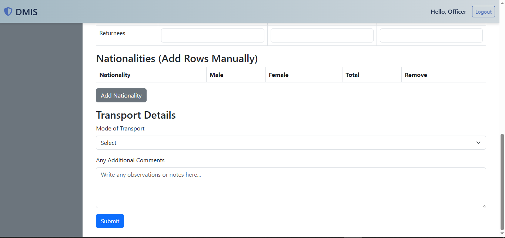

## migrate
## seed the database

## Default Login Credentials

### Super Admin
- **Email:** superadmin@example.com
- **Password:** SuperAdmin123!

### Admin
- **Email:** admin@example.com
- **Password:** Admin123!

### Officer
- **Email:** officer@example.com
- **Password:** Officer123!

> These accounts are created by the seeders in `database/seeders/`. You can log in with these credentials after running the database seed command.

